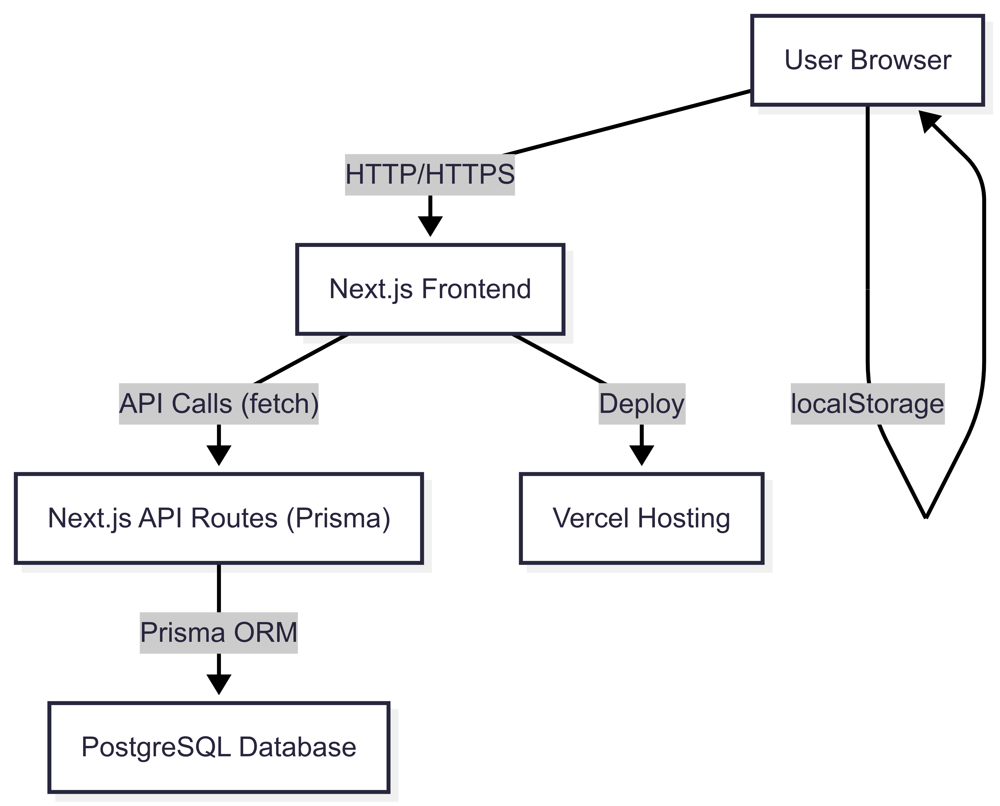

# StudyCore

A collaborative study app for real-time problem-solving, now powered by **PostgreSQL + Prisma** for robust, scalable data management.

---

## Project Architecture (PostgreSQL + Prisma)



- **Frontend:** Next.js (React) with Tailwind CSS for UI.
- **Backend:** Next.js API routes using Prisma ORM to query a PostgreSQL database.
- **Database:** PostgreSQL (Supabase cloud database).
- **Hosting:** Vercel (serverless deployment).
- **State:** React state for UI, Prisma for DB access, localStorage for persistent user identity.

---

## Data Model (Prisma)

### **Room**
- `id`: UUID (primary key)
- `createdAt`: DateTime
- `question`: String? (optional)
- `revealed`: Boolean
- `hostId`: UUID
- `answers`: One-to-many relation to Answer
- `participants`: One-to-many relation to User

### **User**
- `id`: UUID (primary key)
- `userId`: String (unique localStorage userId)
- `username`: String
- `roomId`: UUID (foreign key to Room)
- `lastSeen`: DateTime
- `createdAt`: DateTime
- `answers`: One-to-many relation to Answer

### **Answer**
- `id`: UUID (primary key)
- `roomId`: UUID (foreign key to Room)
- `userId`: String
- `username`: String
- `text`: String
- `timestamp`: DateTime
- `revealed`: Boolean
- `user`: Optional relation to User

---

## Data Flow & Real-Time Polling

- **Room Creation:**
  - Frontend calls `/api/room` (POST) → API route uses Prisma to create a new Room in Postgres.
- **Room Fetching:**
  - Frontend calls `/api/room/[roomId]` (GET) → API route uses Prisma to fetch Room data.
- **Answer Submission:**
  - Frontend calls `/api/room/[roomId]/answers` (POST) → API route uses Prisma to create a new Answer.
- **Answer Fetching:**
  - Frontend calls `/api/room/[roomId]/answers` (GET) → API route uses Prisma to fetch all Answers for the room.
- **Reveal Answers:**
  - Host calls `/api/room/[roomId]` (PATCH) to set `revealed: true`.
- **Real-Time Sync:**
  - The frontend uses `setInterval` to poll the API every 5 seconds for room, answer, and user updates, mimicking real-time collaboration.
- **User Management:**
  - Users are automatically tracked when they join rooms
  - Host is displayed with a crown icon at the top of the participant list
  - Answer status is shown for each participant (answered/pending)
  - Host cannot reveal answers until all participants have answered

---

## Project Structure

```
StudyCore/
├── pages/
│   ├── index.tsx                # Landing page
│   ├── api/
│   │   ├── room.ts              # Create room (POST)
│   │   └── room/
│   │       ├── [roomId].ts      # Get/update room (GET/PATCH)
│   │       ├── [roomId]/answers.ts # Get/create answers (GET/POST)
│   │       └── [roomId]/users.ts # Get/create/delete users (GET/POST/DELETE)
│   └── room/
│       └── [roomId].tsx         # Room page (frontend logic)
├── components/
│   └── ParticipantsSidebar.tsx  # Participant list sidebar component
├── lib/
│   └── prisma.ts                # Prisma client singleton
├── prisma/
│   └── schema.prisma            # Prisma schema (SQLite models)
├── styles/
│   └── globals.css              # Tailwind CSS imports
├── tailwind.config.js           # Tailwind config
├── postcss.config.js            # PostCSS config
├── package.json
└── README.md
```

---

## How It Works
- All data is stored in PostgreSQL, accessed via Prisma in Next.js API routes.
- The frontend never talks to the database directly—only via API routes.
- Real-time sync is achieved by polling the API every 3 seconds for room and answer updates.
- All business logic (room creation, answer submission, reveal) is handled server-side with Prisma.

---

## Tech Stack
- Next.js (React, API routes)
- Tailwind CSS
- PostgreSQL (Supabase, Railway, Neon, or local)
- Prisma ORM
- Vercel (hosting)

---

